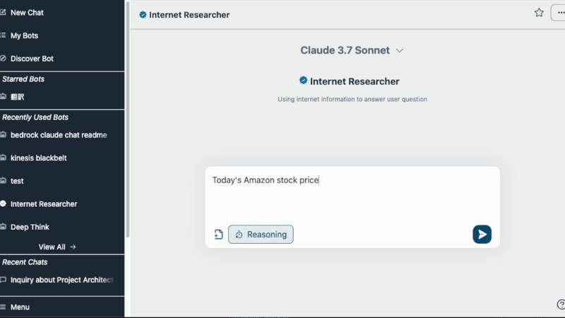
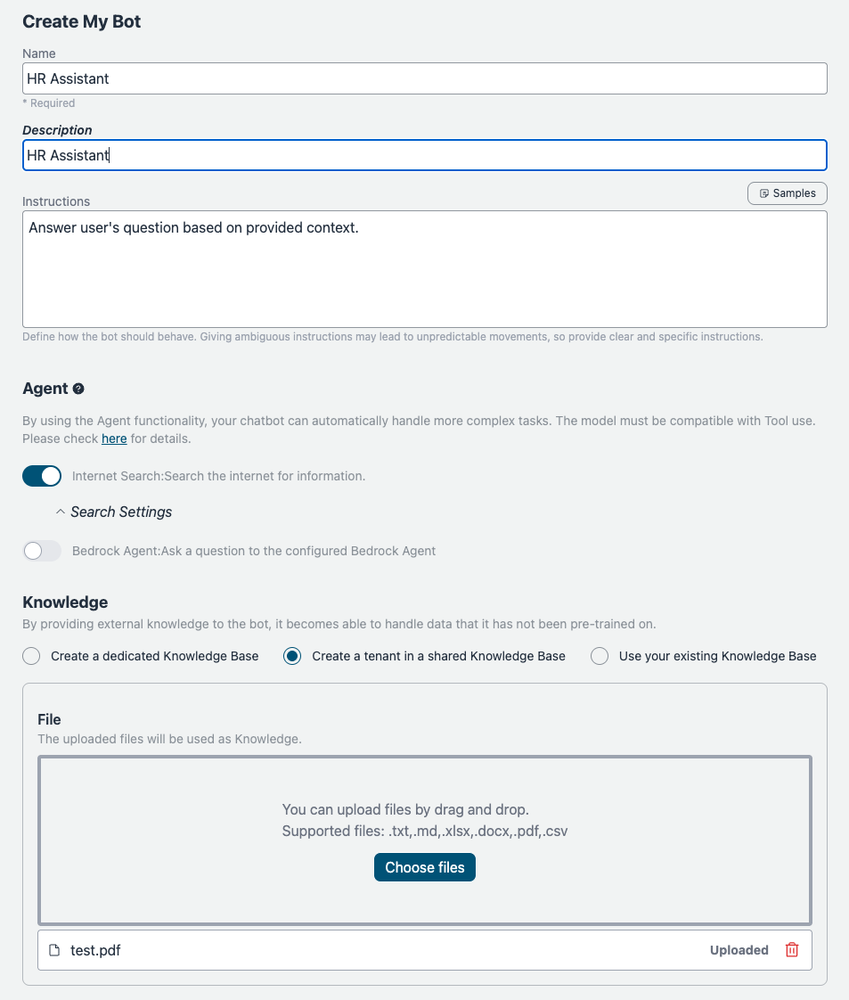
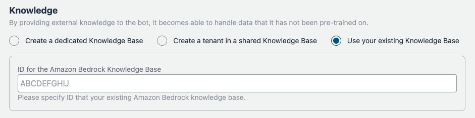

<h1 align="center">Bedrock Chat (BrChat)</h1>

<p align="center">
  
  
  
  <a href="https://github.com/aws-samples/bedrock-chat/issues?q=is%3Aissue%20state%3Aopen%20label%3Aroadmap">
    
  </a>
</p>

[English](https://github.com/aws-samples/bedrock-chat/blob/v3/README.md) | [日本語](https://github.com/aws-samples/bedrock-chat/blob/v3/docs/README_ja-JP.md) | [한국어](https://github.com/aws-samples/bedrock-chat/blob/v3/docs/README_ko-KR.md) | [中文](https://github.com/aws-samples/bedrock-chat/blob/v3/docs/README_zh-CN.md) | [Français](https://github.com/aws-samples/bedrock-chat/blob/v3/docs/README_fr-FR.md) | [Deutsch](https://github.com/aws-samples/bedrock-chat/blob/v3/docs/README_de-DE.md) | [Español](https://github.com/aws-samples/bedrock-chat/blob/v3/docs/README_es-ES.md) | [Italian](https://github.com/aws-samples/bedrock-chat/blob/v3/docs/README_it-IT.md) | [Norsk](https://github.com/aws-samples/bedrock-chat/blob/v3/docs/README_nb-NO.md) | [ไทย](https://github.com/aws-samples/bedrock-chat/blob/v3/docs/README_th-TH.md) | [Bahasa Indonesia](https://github.com/aws-samples/bedrock-chat/blob/v3/docs/README_id-ID.md) | [Bahasa Melayu](https://github.com/aws-samples/bedrock-chat/blob/v3/docs/README_ms-MY.md) | [Tiếng Việt](https://github.com/aws-samples/bedrock-chat/blob/v3/docs/README_vi-VN.md) | [Polski](https://github.com/aws-samples/bedrock-chat/blob/v3/docs/README_pl-PL.md) | [Português Brasil](https://github.com/aws-samples/bedrock-chat/blob/v3/docs/README_pt-BR.md)


Wielojęzyczna platforma generatywnej sztucznej inteligencji zasilana przez [Amazon Bedrock](https://aws.amazon.com/bedrock/).
Obsługuje czat, niestandardowe boty z wiedzą (RAG), udostępnianie botów poprzez sklep z botami oraz automatyzację zadań przy użyciu agentów.



> [!Warning]
>
> **Wydano wersję V3. Aby zaktualizować, proszę uważnie zapoznać się z [przewodnikiem migracji](./migration/V2_TO_V3_pl-PL.md).** Bez odpowiedniej ostrożności **BOTY Z V2 STANĄ SIĘ BEZUŻYTECZNE.**

### Personalizacja botów / Sklep z botami

Dodaj własne instrukcje i wiedzę (tzw. [RAG](https://aws.amazon.com/what-is/retrieval-augmented-generation/)). Bot może być udostępniany między użytkownikami aplikacji poprzez sklep z botami. Spersonalizowany bot może być również opublikowany jako samodzielne API (Zobacz [szczegóły](./PUBLISH_API_pl-PL.md)).

<details>
<summary>Zrzuty ekranu</summary>




Możesz także zaimportować istniejące [Amazon Bedrock's KnowledgeBase](https://aws.amazon.com/bedrock/knowledge-bases/).



</details>

> [!Important]
> Ze względów zarządzania, tylko uprawnieni użytkownicy mogą tworzyć spersonalizowane boty. Aby umożliwić tworzenie spersonalizowanych botów, użytkownik musi być członkiem grupy o nazwie `CreatingBotAllowed`, którą można skonfigurować poprzez konsolę zarządzania > Amazon Cognito User pools lub aws cli. Należy zauważyć, że id puli użytkowników można sprawdzić w CloudFormation > BedrockChatStack > Outputs > `AuthUserPoolIdxxxx`.

### Funkcje administracyjne

Zarządzanie API, oznaczanie botów jako niezbędne, analizowanie wykorzystania botów. [szczegóły](./ADMINISTRATOR_pl-PL.md)

<details>
<summary>Zrzuty ekranu</summary>


)

</details>

### Agent

Korzystając z [funkcjonalności Agenta](./AGENT_pl-PL.md), Twój chatbot może automatycznie obsługiwać bardziej złożone zadania. Na przykład, aby odpowiedzieć na pytanie użytkownika, Agent może pobrać niezbędne informacje z zewnętrznych narzędzi lub podzielić zadanie na wiele kroków do przetworzenia.

<details>
<summary>Zrzuty ekranu</summary>


</details>

## 🚀 Super-łatwe wdrożenie

- W regionie us-east-1 otwórz [Bedrock Model access](https://us-east-1.console.aws.amazon.com/bedrock/home?region=us-east-1#/modelaccess) > `Manage model access` > Zaznacz wszystkie modele, których chcesz używać, a następnie `Save changes`.

<details>
<summary>Zrzut ekranu</summary>


</details>

### Obsługiwane regiony

Upewnij się, że wdrażasz Bedrock Chat w regionie, [gdzie OpenSearch Serverless i API Ingestion są dostępne](https://docs.aws.amazon.com/general/latest/gr/opensearch-service.html), jeśli chcesz korzystać z botów i tworzyć bazy wiedzy (OpenSearch Serverless jest domyślnym wyborem). Od sierpnia 2025 r. obsługiwane są następujące regiony: us-east-1, us-east-2, us-west-1, us-west-2, ap-south-1, ap-northeast-1, ap-northeast-2, ap-southeast-1, ap-southeast-2, ca-central-1, eu-central-1, eu-west-1, eu-west-2, eu-south-2, eu-north-1, sa-east-1

Dla parametru **bedrock-region** musisz wybrać region, [gdzie Bedrock jest dostępny](https://docs.aws.amazon.com/general/latest/gr/bedrock.html).

- Otwórz [CloudShell](https://console.aws.amazon.com/cloudshell/home) w regionie, w którym chcesz przeprowadzić wdrożenie
- Uruchom wdrożenie za pomocą następujących poleceń. Jeśli chcesz określić wersję do wdrożenia lub potrzebujesz zastosować polityki bezpieczeństwa, określ odpowiednie parametry z [Parametrów opcjonalnych](#optional-parameters).

```sh
git clone https://github.com/aws-samples/bedrock-chat.git
cd bedrock-chat
chmod +x bin.sh
./bin.sh
```

- Zostaniesz zapytany, czy jesteś nowym użytkownikiem czy korzystasz z v3. Jeśli nie jesteś kontynuującym użytkownikiem z v0, wpisz `y`.

### Parametry opcjonalne

Możesz określić następujące parametry podczas wdrażania, aby zwiększyć bezpieczeństwo i dostosowanie:

- **--disable-self-register**: Wyłącza samodzielną rejestrację (domyślnie: włączona). Jeśli ta flaga jest ustawiona, będziesz musiał utworzyć wszystkich użytkowników w cognito i nie pozwoli użytkownikom na samodzielną rejestrację kont.
- **--enable-lambda-snapstart**: Włącza [Lambda SnapStart](https://docs.aws.amazon.com/lambda/latest/dg/snapstart.html) (domyślnie: wyłączone). Jeśli ta flaga jest ustawiona, poprawia czas zimnego startu funkcji Lambda, zapewniając szybsze czasy odpowiedzi dla lepszego doświadczenia użytkownika.
- **--ipv4-ranges**: Lista zakresów IPv4 oddzielonych przecinkami. (domyślnie: zezwala na wszystkie adresy ipv4)
- **--ipv6-ranges**: Lista zakresów IPv6 oddzielonych przecinkami. (domyślnie: zezwala na wszystkie adresy ipv6)
- **--disable-ipv6**: Wyłącza połączenia przez IPv6. (domyślnie: włączone)
- **--allowed-signup-email-domains**: Lista domen e-mail dozwolonych do rejestracji, oddzielonych przecinkami. (domyślnie: brak ograniczeń domeny)
- **--bedrock-region**: Określa region, gdzie Bedrock jest dostępny. (domyślnie: us-east-1)
- **--repo-url**: Niestandardowe repozytorium Bedrock Chat do wdrożenia, jeśli jest zforkowane lub ma niestandardową kontrolę źródła. (domyślnie: https://github.com/aws-samples/bedrock-chat.git)
- **--version**: Wersja Bedrock Chat do wdrożenia. (domyślnie: najnowsza wersja w rozwoju)
- **--cdk-json-override**: Możesz nadpisać dowolne wartości kontekstu CDK podczas wdrażania za pomocą bloku JSON override. Pozwala to na modyfikację konfiguracji bez bezpośredniej edycji pliku cdk.json.

Przykład użycia:

```bash
./bin.sh --cdk-json-override '{
  "context": {
    "selfSignUpEnabled": false,
    "enableLambdaSnapStart": true,
    "allowedIpV4AddressRanges": ["192.168.1.0/24"],
    "allowedCountries": ["US", "CA"],
    "allowedSignUpEmailDomains": ["example.com"],
    "globalAvailableModels": [
      "claude-v3.7-sonnet",
      "claude-v3.5-sonnet",
      "amazon-nova-pro",
      "amazon-nova-lite",
      "llama3-3-70b-instruct"
    ]
  }
}'
```

JSON override musi zachować tę samą strukturę co cdk.json. Możesz nadpisać dowolne wartości kontekstu, w tym:

- `selfSignUpEnabled`
- `enableLambdaSnapStart`
- `allowedIpV4AddressRanges`
- `allowedIpV6AddressRanges`
- `allowedCountries`
- `allowedSignUpEmailDomains`
- `bedrockRegion`
- `enableRagReplicas`
- `enableBedrockCrossRegionInference`
- `globalAvailableModels`: przyjmuje listę ID modeli do włączenia. Wartość domyślna to pusta lista, która włącza wszystkie modele.
- `logoPath`: względna ścieżka do zasobu logo w katalogu frontend `public/`, który pojawia się na górze szuflady nawigacyjnej.
- I inne wartości kontekstu zdefiniowane w cdk.json

> [!Note]
> Wartości override zostaną połączone z istniejącą konfiguracją cdk.json podczas wdrażania w AWS code build. Wartości określone w override będą miały pierwszeństwo przed wartościami w cdk.json.

#### Przykładowe polecenie z parametrami:

```sh
./bin.sh --disable-self-register --ipv4-ranges "192.0.2.0/25,192.0.2.128/25" --ipv6-ranges "2001:db8:1:2::/64,2001:db8:1:3::/64" --allowed-signup-email-domains "example.com,anotherexample.com" --bedrock-region "us-west-2" --version "v1.2.6"
```

- Po około 35 minutach otrzymasz następujące wyjście, do którego możesz uzyskać dostęp z przeglądarki

```
Frontend URL: https://xxxxxxxxx.cloudfront.net
```


Pojawi się ekran rejestracji, jak pokazano powyżej, gdzie możesz zarejestrować swój email i zalogować się.

> [!Important]
> Bez ustawienia parametrów opcjonalnych, ta metoda wdrożenia pozwala każdemu, kto zna URL, na rejestrację. Do użytku produkcyjnego zdecydowanie zaleca się dodanie ograniczeń adresów IP i wyłączenie samodzielnej rejestracji w celu zmniejszenia ryzyka bezpieczeństwa (możesz zdefiniować allowed-signup-email-domains, aby ograniczyć użytkowników tak, by tylko adresy email z domeny twojej firmy mogły się zarejestrować). Użyj zarówno ipv4-ranges jak i ipv6-ranges do ograniczeń adresów IP, i wyłącz samodzielną rejestrację używając disable-self-register podczas wykonywania ./bin.

> [!TIP]
> Jeśli `Frontend URL` nie pojawia się lub Bedrock Chat nie działa prawidłowo, może to być problem z najnowszą wersją. W takim przypadku dodaj `--version "v3.0.0"` do parametrów i spróbuj wdrożyć ponownie.

## Architektura

Jest to architektura zbudowana na zarządzanych usługach AWS, eliminująca potrzebę zarządzania infrastrukturą. Dzięki wykorzystaniu Amazon Bedrock nie ma potrzeby komunikacji z API poza AWS. Umożliwia to wdrażanie skalowalnych, niezawodnych i bezpiecznych aplikacji.

- [Amazon DynamoDB](https://aws.amazon.com/dynamodb/): Baza danych NoSQL do przechowywania historii konwersacji
- [Amazon API Gateway](https://aws.amazon.com/api-gateway/) + [AWS Lambda](https://aws.amazon.com/lambda/): Punkt końcowy API backendu ([AWS Lambda Web Adapter](https://github.com/awslabs/aws-lambda-web-adapter), [FastAPI](https://fastapi.tiangolo.com/))
- [Amazon CloudFront](https://aws.amazon.com/cloudfront/) + [S3](https://aws.amazon.com/s3/): Dostarczanie aplikacji frontendowej ([React](https://react.dev/), [Tailwind CSS](https://tailwindcss.com/))
- [AWS WAF](https://aws.amazon.com/waf/): Ograniczenia adresów IP
- [Amazon Cognito](https://aws.amazon.com/cognito/): Uwierzytelnianie użytkowników
- [Amazon Bedrock](https://aws.amazon.com/bedrock/): Zarządzana usługa do wykorzystywania modeli podstawowych poprzez API
- [Amazon Bedrock Knowledge Bases](https://aws.amazon.com/bedrock/knowledge-bases/): Zapewnia zarządzany interfejs do generowania z wykorzystaniem wyszukiwania ([RAG](https://aws.amazon.com/what-is/retrieval-augmented-generation/)), oferując usługi osadzania i parsowania dokumentów
- [Amazon EventBridge Pipes](https://aws.amazon.com/eventbridge/pipes/): Odbieranie zdarzeń ze strumienia DynamoDB i uruchamianie Step Functions do osadzania zewnętrznej wiedzy
- [AWS Step Functions](https://aws.amazon.com/step-functions/): Orkiestracja procesu wprowadzania danych w celu osadzenia zewnętrznej wiedzy w Bedrock Knowledge Bases
- [Amazon OpenSearch Serverless](https://aws.amazon.com/opensearch-service/features/serverless/): Służy jako baza danych backend dla Bedrock Knowledge Bases, zapewniając możliwości wyszukiwania pełnotekstowego i wektorowego, umożliwiając dokładne wyszukiwanie istotnych informacji
- [Amazon Athena](https://aws.amazon.com/athena/): Usługa zapytań do analizy bucket'ów S3


## Wdrożenie przy użyciu CDK

Super łatwe wdrożenie wykorzystuje [AWS CodeBuild](https://aws.amazon.com/codebuild/) do wykonania wdrożenia przez CDK wewnętrznie. Ta sekcja opisuje procedurę bezpośredniego wdrażania za pomocą CDK.

- Wymagany jest system UNIX, Docker i środowisko uruchomieniowe Node.js.

> [!Important]
> Jeśli w lokalnym środowisku podczas wdrażania brakuje miejsca na dysku, bootstrap CDK może zakończyć się błędem. Zalecamy zwiększenie rozmiaru woluminu instancji przed wdrożeniem.

- Sklonuj to repozytorium

```
git clone https://github.com/aws-samples/bedrock-chat
```

- Zainstaluj pakiety npm

```
cd bedrock-chat
cd cdk
npm ci
```

- W razie potrzeby edytuj następujące wpisy w [cdk.json](./cdk/cdk.json).

  - `bedrockRegion`: Region, w którym dostępny jest Bedrock. **UWAGA: Bedrock NIE wspiera obecnie wszystkich regionów.**
  - `allowedIpV4AddressRanges`, `allowedIpV6AddressRanges`: Dozwolony zakres adresów IP.
  - `enableLambdaSnapStart`: Domyślnie true. Ustaw na false jeśli wdrażasz w [regionie, który nie wspiera Lambda SnapStart dla funkcji Python](https://docs.aws.amazon.com/lambda/latest/dg/snapstart.html#snapstart-supported-regions).
  - `globalAvailableModels`: Domyślnie wszystkie. Jeśli ustawione (lista ID modeli), pozwala globalnie kontrolować, które modele pojawiają się w menu rozwijanych podczas czatów dla wszystkich użytkowników i podczas tworzenia botów w aplikacji Bedrock Chat.
  - `logoPath`: Względna ścieżka w `frontend/public` wskazująca na obraz wyświetlany u góry szuflady aplikacji.
Obsługiwane są następujące ID modeli (upewnij się, że są one również włączone w konsoli Bedrock w sekcji Model access w Twoim regionie wdrożenia):
- **Modele Claude:** `claude-v4-opus`, `claude-v4.1-opus`, `claude-v4-sonnet`, `claude-v3.5-sonnet`, `claude-v3.5-sonnet-v2`, `claude-v3.7-sonnet`, `claude-v3.5-haiku`, `claude-v3-haiku`, `claude-v3-opus`
- **Modele Amazon Nova:** `amazon-nova-pro`, `amazon-nova-lite`, `amazon-nova-micro`
- **Modele Mistral:** `mistral-7b-instruct`, `mixtral-8x7b-instruct`, `mistral-large`, `mistral-large-2`
- **Modele DeepSeek:** `deepseek-r1`
- **Modele Meta Llama:** `llama3-3-70b-instruct`, `llama3-2-1b-instruct`, `llama3-2-3b-instruct`, `llama3-2-11b-instruct`, `llama3-2-90b-instruct`

Pełna lista znajduje się w [index.ts](./frontend/src/constants/index.ts).

- Przed wdrożeniem CDK, musisz wykonać Bootstrap jeden raz dla regionu, w którym wdrażasz.

```
npx cdk bootstrap
```

- Wdróż ten przykładowy projekt

```
npx cdk deploy --require-approval never --all
```

- Otrzymasz wynik podobny do poniższego. URL aplikacji internetowej zostanie wyświetlony w `BedrockChatStack.FrontendURL`, więc należy uzyskać do niego dostęp z przeglądarki.

```sh
 ✅  BedrockChatStack

✨  Deployment time: 78.57s

Outputs:
BedrockChatStack.AuthUserPoolClientIdXXXXX = xxxxxxx
BedrockChatStack.AuthUserPoolIdXXXXXX = ap-northeast-1_XXXX
BedrockChatStack.BackendApiBackendApiUrlXXXXX = https://xxxxx.execute-api.ap-northeast-1.amazonaws.com
BedrockChatStack.FrontendURL = https://xxxxx.cloudfront.net
```

### Definiowanie Parametrów

Możesz zdefiniować parametry dla swojego wdrożenia na dwa sposoby: używając `cdk.json` lub używając bezpiecznego typowo pliku `parameter.ts`.

#### Używanie cdk.json (Tradycyjna Metoda)

Tradycyjnym sposobem konfiguracji parametrów jest edycja pliku `cdk.json`. To podejście jest proste, ale nie posiada sprawdzania typów:

```json
{
  "app": "npx ts-node --prefer-ts-exts bin/bedrock-chat.ts",
  "context": {
    "bedrockRegion": "us-east-1",
    "allowedIpV4AddressRanges": ["0.0.0.0/1", "128.0.0.0/1"],
    "selfSignUpEnabled": true,
    "globalAvailableModels": [
      "claude-v3.7-sonnet",
      "claude-v3.5-sonnet",
      "amazon-nova-pro",
      "amazon-nova-lite",
      "llama3-3-70b-instruct"
    ],
  }
}
```

#### Używanie parameter.ts (Zalecana Metoda Bezpieczna Typowo)

Dla lepszej bezpieczeństwa typów i doświadczenia programisty, możesz użyć pliku `parameter.ts` do zdefiniowania parametrów:

```typescript
// Zdefiniuj parametry dla domyślnego środowiska
bedrockChatParams.set("default", {
  bedrockRegion: "us-east-1",
  allowedIpV4AddressRanges: ["192.168.0.0/16"],
  selfSignUpEnabled: true,
  globalAvailableModels: [
      "claude-v3.7-sonnet",
      "claude-v3.5-sonnet",
      "amazon-nova-pro",
      "amazon-nova-lite",
      "llama3-3-70b-instruct"
    ],
});

// Zdefiniuj parametry dla dodatkowych środowisk
bedrockChatParams.set("dev", {
  bedrockRegion: "us-west-2",
  allowedIpV4AddressRanges: ["10.0.0.0/8"],
  enableRagReplicas: false, // Oszczędność kosztów dla środowiska dev
  enableBotStoreReplicas: false, // Oszczędność kosztów dla środowiska dev
});

bedrockChatParams.set("prod", {
  bedrockRegion: "us-east-1",
  allowedIpV4AddressRanges: ["172.16.0.0/12"],
  enableLambdaSnapStart: true,
  enableRagReplicas: true, // Zwiększona dostępność dla produkcji
  enableBotStoreReplicas: true, // Zwiększona dostępność dla produkcji
});
```

> [!Note]
> Istniejący użytkownicy mogą nadal używać `cdk.json` bez żadnych zmian. Podejście `parameter.ts` jest zalecane dla nowych wdrożeń lub gdy potrzebujesz zarządzać wieloma środowiskami.

### Wdrażanie Wielu Środowisk

Możesz wdrożyć wiele środowisk z tego samego kodu źródłowego używając pliku `parameter.ts` i opcji `-c envName`.

#### Wymagania Wstępne

1. Zdefiniuj swoje środowiska w `parameter.ts` jak pokazano powyżej
2. Każde środowisko będzie miało własny zestaw zasobów z prefiksami specyficznymi dla środowiska

#### Komendy Wdrożeniowe

Aby wdrożyć określone środowisko:

```bash
# Wdróż środowisko dev
npx cdk deploy --all -c envName=dev

# Wdróż środowisko prod
npx cdk deploy --all -c envName=prod
```

Jeśli nie określono środowiska, używane jest środowisko "default":

```bash
# Wdróż środowisko domyślne
npx cdk deploy --all
```

#### Ważne Uwagi

1. **Nazewnictwo Stosów**:

   - Główne stosy dla każdego środowiska będą miały prefiks z nazwą środowiska (np. `dev-BedrockChatStack`, `prod-BedrockChatStack`)
   - Jednak stosy niestandardowych botów (`BrChatKbStack*`) i stosy publikowania API (`ApiPublishmentStack*`) nie otrzymują prefiksów środowiskowych, ponieważ są tworzone dynamicznie w czasie wykonywania

2. **Nazewnictwo Zasobów**:

   - Tylko niektóre zasoby otrzymują prefiksy środowiskowe w swoich nazwach (np. tabela `dev_ddb_export`, `dev-FrontendWebAcl`)
   - Większość zasobów zachowuje swoje oryginalne nazwy, ale jest izolowana przez bycie w różnych stosach

3. **Identyfikacja Środowiska**:

   - Wszystkie zasoby są oznaczone tagiem `CDKEnvironment` zawierającym nazwę środowiska
   - Możesz użyć tego tagu do identyfikacji, do którego środowiska należy zasób
   - Przykład: `CDKEnvironment: dev` lub `CDKEnvironment: prod`

4. **Nadpisanie Środowiska Domyślnego**: Jeśli zdefiniujesz środowisko "default" w `parameter.ts`, nadpisze ono ustawienia w `cdk.json`. Aby nadal używać `cdk.json`, nie definiuj środowiska "default" w `parameter.ts`.

5. **Wymagania Środowiskowe**: Aby utworzyć środowiska inne niż "default", musisz użyć `parameter.ts`. Sama opcja `-c envName` nie jest wystarczająca bez odpowiednich definicji środowisk.

6. **Izolacja Zasobów**: Każde środowisko tworzy własny zestaw zasobów, pozwalając na posiadanie środowisk rozwojowych, testowych i produkcyjnych w tym samym koncie AWS bez konfliktów.

## Inne

Parametry wdrożenia można zdefiniować na dwa sposoby: używając pliku `cdk.json` lub używając bezpiecznego pod względem typów pliku `parameter.ts`.

#### Używanie cdk.json (Tradycyjna Metoda)

Tradycyjnym sposobem konfiguracji parametrów jest edycja pliku `cdk.json`. To podejście jest proste, ale nie zapewnia sprawdzania typów:

```json
{
  "app": "npx ts-node --prefer-ts-exts bin/bedrock-chat.ts",
  "context": {
    "bedrockRegion": "us-east-1",
    "allowedIpV4AddressRanges": ["0.0.0.0/1", "128.0.0.0/1"],
    "selfSignUpEnabled": true
  }
}
```

#### Używanie parameter.ts (Zalecana Metoda z Bezpiecznymi Typami)

Dla lepszej kontroli typów i wygody programisty możesz użyć pliku `parameter.ts` do zdefiniowania parametrów:

```typescript
// Definiowanie parametrów dla domyślnego środowiska
bedrockChatParams.set("default", {
  bedrockRegion: "us-east-1",
  allowedIpV4AddressRanges: ["192.168.0.0/16"],
  selfSignUpEnabled: true,
});

// Definiowanie parametrów dla dodatkowych środowisk
bedrockChatParams.set("dev", {
  bedrockRegion: "us-west-2",
  allowedIpV4AddressRanges: ["10.0.0.0/8"],
  enableRagReplicas: false, // Oszczędność kosztów dla środowiska dev
});

bedrockChatParams.set("prod", {
  bedrockRegion: "us-east-1",
  allowedIpV4AddressRanges: ["172.16.0.0/12"],
  enableLambdaSnapStart: true,
  enableRagReplicas: true, // Zwiększona dostępność dla produkcji
});
```

> [!Note]
> Obecni użytkownicy mogą nadal korzystać z `cdk.json` bez żadnych zmian. Podejście z `parameter.ts` jest zalecane dla nowych wdrożeń lub gdy potrzebujesz zarządzać wieloma środowiskami.

### Wdrażanie Wielu Środowisk

Możesz wdrażać wiele środowisk z tego samego kodu źródłowego używając pliku `parameter.ts` i opcji `-c envName`.

#### Wymagania Wstępne

1. Zdefiniuj swoje środowiska w `parameter.ts` jak pokazano powyżej
2. Każde środowisko będzie miało własny zestaw zasobów z prefiksami specyficznymi dla środowiska

#### Polecenia Wdrożeniowe

Aby wdrożyć określone środowisko:

```bash
# Wdrożenie środowiska dev
npx cdk deploy --all -c envName=dev

# Wdrożenie środowiska prod
npx cdk deploy --all -c envName=prod
```

Jeśli nie określono środowiska, używane jest środowisko "default":

```bash
# Wdrożenie domyślnego środowiska
npx cdk deploy --all
```

#### Ważne Uwagi

1. **Nazewnictwo Stosów**:

   - Główne stosy dla każdego środowiska będą miały prefiks z nazwą środowiska (np. `dev-BedrockChatStack`, `prod-BedrockChatStack`)
   - Jednak stosy niestandardowych botów (`BrChatKbStack*`) i stosy publikowania API (`ApiPublishmentStack*`) nie otrzymują prefiksów środowiskowych, ponieważ są tworzone dynamicznie w czasie wykonywania

2. **Nazewnictwo Zasobów**:

   - Tylko niektóre zasoby otrzymują prefiksy środowiskowe w swoich nazwach (np. tabela `dev_ddb_export`, `dev-FrontendWebAcl`)
   - Większość zasobów zachowuje swoje oryginalne nazwy, ale jest izolowana poprzez umieszczenie w różnych stosach

3. **Identyfikacja Środowiska**:

   - Wszystkie zasoby są oznaczone tagiem `CDKEnvironment` zawierającym nazwę środowiska
   - Możesz użyć tego tagu do identyfikacji, do którego środowiska należy zasób
   - Przykład: `CDKEnvironment: dev` lub `CDKEnvironment: prod`

4. **Nadpisywanie Środowiska Domyślnego**: Jeśli zdefiniujesz środowisko "default" w `parameter.ts`, nadpisze ono ustawienia w `cdk.json`. Aby nadal korzystać z `cdk.json`, nie definiuj środowiska "default" w `parameter.ts`.

5. **Wymagania Środowiskowe**: Aby utworzyć środowiska inne niż "default", musisz użyć `parameter.ts`. Sama opcja `-c envName` nie jest wystarczająca bez odpowiednich definicji środowisk.

6. **Izolacja Zasobów**: Każde środowisko tworzy własny zestaw zasobów, co pozwala na posiadanie środowisk rozwojowych, testowych i produkcyjnych w tym samym koncie AWS bez konfliktów.

## Inne

### Usuwanie zasobów

Jeśli używasz CLI i CDK, wykonaj `npx cdk destroy`. W przeciwnym razie przejdź do [CloudFormation](https://console.aws.amazon.com/cloudformation/home) i ręcznie usuń `BedrockChatStack` oraz `FrontendWafStack`. Pamiętaj, że `FrontendWafStack` znajduje się w regionie `us-east-1`.

### Ustawienia języka

Ten zasób automatycznie wykrywa język za pomocą [i18next-browser-languageDetector](https://github.com/i18next/i18next-browser-languageDetector). Możesz przełączać języki z menu aplikacji. Alternatywnie możesz użyć parametru Query String, aby ustawić język jak pokazano poniżej.

> `https://example.com?lng=ja`

### Wyłączanie samodzielnej rejestracji

Ta przykładowa aplikacja ma domyślnie włączoną samodzielną rejestrację. Aby ją wyłączyć, otwórz [cdk.json](./cdk/cdk.json) i zmień `selfSignUpEnabled` na `false`. Jeśli skonfigurujesz [zewnętrznego dostawcę tożsamości](#external-identity-provider), ta wartość zostanie zignorowana i automatycznie wyłączona.

### Ograniczanie domen dla adresów email przy rejestracji

Domyślnie ta przykładowa aplikacja nie ogranicza domen dla adresów email przy rejestracji. Aby zezwolić na rejestrację tylko z określonych domen, otwórz `cdk.json` i określ domeny jako listę w `allowedSignUpEmailDomains`.

```ts
"allowedSignUpEmailDomains": ["example.com"],
```

### Zewnętrzny dostawca tożsamości

Ta przykładowa aplikacja obsługuje zewnętrznego dostawcę tożsamości. Obecnie wspieramy [Google](./idp/SET_UP_GOOGLE_pl-PL.md) i [niestandardowego dostawcę OIDC](./idp/SET_UP_CUSTOM_OIDC_pl-PL.md).

### Opcjonalny Frontend WAF

Dla dystrybucji CloudFront, listy kontroli dostępu AWS WAF WebACL muszą być tworzone w regionie us-east-1. W niektórych organizacjach tworzenie zasobów poza głównym regionem jest ograniczone przez politykę. W takich środowiskach wdrożenie CDK może nie powieść się podczas próby utworzenia Frontend WAF w us-east-1.

Aby dostosować się do tych ograniczeń, stos Frontend WAF jest opcjonalny. Gdy jest wyłączony, dystrybucja CloudFront jest wdrażana bez WebACL. Oznacza to, że nie będziesz miał kontroli zezwoleń/blokad IP na frontendzie. Uwierzytelnianie i wszystkie inne kontrole aplikacji działają normalnie. Pamiętaj, że to ustawienie wpływa tylko na Frontend WAF (zakres CloudFront); WAF API (regionalny) pozostaje bez zmian.

Aby wyłączyć Frontend WAF, ustaw następujące w `parameter.ts` (Zalecana metoda z kontrolą typów):

```ts
bedrockChatParams.set("default", {
  enableFrontendWaf: false
});
```

Lub jeśli używasz starszego `cdk/cdk.json` ustaw:

```json
"enableFrontendWaf": false
``` 

### Automatyczne dodawanie nowych użytkowników do grup

Ta przykładowa aplikacja ma następujące grupy nadające uprawnienia użytkownikom:

- [`Admin`](./ADMINISTRATOR_pl-PL.md)
- [`CreatingBotAllowed`](#bot-personalization)
- [`PublishAllowed`](./PUBLISH_API_pl-PL.md)

Jeśli chcesz, aby nowo utworzeni użytkownicy automatycznie dołączali do grup, możesz je określić w [cdk.json](./cdk/cdk.json).

```json
"autoJoinUserGroups": ["CreatingBotAllowed"],
```

Domyślnie nowo utworzeni użytkownicy będą dołączani do grupy `CreatingBotAllowed`.

### Konfiguracja replik RAG

`enableRagReplicas` to opcja w [cdk.json](./cdk/cdk.json), która kontroluje ustawienia replik dla bazy danych RAG, w szczególności Baz Wiedzy wykorzystujących Amazon OpenSearch Serverless.

- **Domyślnie**: true
- **true**: Zwiększa dostępność poprzez włączenie dodatkowych replik, co jest odpowiednie dla środowisk produkcyjnych, ale zwiększa koszty.
- **false**: Zmniejsza koszty poprzez użycie mniejszej liczby replik, co jest odpowiednie do rozwoju i testowania.

Jest to ustawienie na poziomie konta/regionu, wpływające na całą aplikację, a nie na pojedyncze boty.

> [!Note]
> Od czerwca 2024, Amazon OpenSearch Serverless obsługuje 0.5 OCU, obniżając koszty początkowe dla małych obciążeń. Wdrożenia produkcyjne mogą zacząć od 2 OCU, podczas gdy obciążenia dev/test mogą używać 1 OCU. OpenSearch Serverless automatycznie skaluje się w zależności od potrzeb. Więcej szczegółów znajdziesz w [ogłoszeniu](https://aws.amazon.com/jp/about-aws/whats-new/2024/06/amazon-opensearch-serverless-entry-cost-half-collection-types/).

### Konfiguracja Bot Store

Funkcja bot store pozwala użytkownikom dzielić się i odkrywać niestandardowe boty. Możesz skonfigurować bot store poprzez następujące ustawienia w [cdk.json](./cdk/cdk.json):

```json
{
  "context": {
    "enableBotStore": true,
    "enableBotStoreReplicas": false,
    "botStoreLanguage": "en"
  }
}
```

- **enableBotStore**: Kontroluje czy funkcja bot store jest włączona (domyślnie: `true`)
- **botStoreLanguage**: Ustawia główny język dla wyszukiwania i odkrywania botów (domyślnie: `"en"`). Wpływa to na sposób indeksowania i wyszukiwania botów w bot store, optymalizując analizę tekstu dla określonego języka.
- **enableBotStoreReplicas**: Kontroluje czy repliki zapasowe są włączone dla kolekcji OpenSearch Serverless używanej przez bot store (domyślnie: `false`). Ustawienie na `true` poprawia dostępność, ale zwiększa koszty, podczas gdy `false` zmniejsza koszty, ale może wpłynąć na dostępność.
  > **Ważne**: Nie można zaktualizować tej właściwości po utworzeniu kolekcji. Jeśli spróbujesz zmodyfikować tę właściwość, kolekcja będzie nadal używać oryginalnej wartości.

### Wnioskowanie między regionami

[Wnioskowanie między regionami](https://docs.aws.amazon.com/bedrock/latest/userguide/inference-profiles-support.html) pozwala Amazon Bedrock dynamicznie kierować żądania wnioskowania modelu między wieloma regionami AWS, zwiększając przepustowość i odporność w okresach szczytowego zapotrzebowania. Aby skonfigurować, edytuj `cdk.json`.

```json
"enableBedrockCrossRegionInference": true
```

### Lambda SnapStart

[Lambda SnapStart](https://docs.aws.amazon.com/lambda/latest/dg/snapstart.html) poprawia czas zimnego startu dla funkcji Lambda, zapewniając szybsze czasy odpowiedzi dla lepszego doświadczenia użytkownika. Z drugiej strony, dla funkcji Python, istnieje [opłata zależna od rozmiaru pamięci podręcznej](https://aws.amazon.com/lambda/pricing/#SnapStart_Pricing) i [nie jest dostępna w niektórych regionach](https://docs.aws.amazon.com/lambda/latest/dg/snapstart.html#snapstart-supported-regions) obecnie. Aby wyłączyć SnapStart, edytuj `cdk.json`.

```json
"enableLambdaSnapStart": false
```

### Konfiguracja domeny niestandardowej

Możesz skonfigurować domenę niestandardową dla dystrybucji CloudFront, ustawiając następujące parametry w [cdk.json](./cdk/cdk.json):

```json
{
  "alternateDomainName": "chat.example.com",
  "hostedZoneId": "Z0123456789ABCDEF"
}
```

- `alternateDomainName`: Niestandardowa nazwa domeny dla twojej aplikacji czatu (np. chat.example.com)
- `hostedZoneId`: ID twojej strefy hostowanej Route 53, gdzie zostaną utworzone rekordy DNS

Gdy te parametry są dostarczone, wdrożenie automatycznie:

- Utworzy certyfikat ACM z walidacją DNS w regionie us-east-1
- Utworzy niezbędne rekordy DNS w twojej strefie hostowanej Route 53
- Skonfiguruje CloudFront do używania twojej niestandardowej domeny

> [!Note]
> Domena musi być zarządzana przez Route 53 na twoim koncie AWS. ID strefy hostowanej można znaleźć w konsoli Route 53.

### Konfiguracja dozwolonych krajów (ograniczenie geograficzne)

Możesz ograniczyć dostęp do Bedrock-Chat na podstawie kraju, z którego klient uzyskuje dostęp.
Użyj parametru `allowedCountries` w [cdk.json](./cdk/cdk.json), który przyjmuje listę [kodów krajów ISO-3166](https://en.wikipedia.org/wiki/List_of_ISO_3166_country_codes).
Na przykład firma z Nowej Zelandii może zdecydować, że tylko adresy IP z Nowej Zelandii (NZ) i Australii (AU) mogą uzyskać dostęp do portalu, a wszyscy inni powinni mieć odmówiony dostęp.
Aby skonfigurować takie zachowanie, użyj następującego ustawienia w [cdk.json](./cdk/cdk.json):

```json
{
  "allowedCountries": ["NZ", "AU"]
}
```

Lub, używając `parameter.ts` (Zalecana metoda z kontrolą typów):

```ts
// Definiowanie parametrów dla domyślnego środowiska
bedrockChatParams.set("default", {
  allowedCountries: ["NZ", "AU"],
});
```

### Wyłączanie obsługi IPv6

Frontend domyślnie otrzymuje zarówno adresy IP, jak i IPv6. W niektórych rzadkich
przypadkach może być konieczne wyraźne wyłączenie obsługi IPv6. Aby to zrobić, ustaw
następujący parametr w [parameter.ts](./cdk/parameter.ts) lub podobnie w [cdk.json](./cdk/cdk.json):

```ts
"enableFrontendIpv6": false
```

Jeśli nie zostanie ustawione, obsługa IPv6 będzie domyślnie włączona.

### Rozwój lokalny

Zobacz [LOCAL DEVELOPMENT](./LOCAL_DEVELOPMENT_pl-PL.md).

### Wkład

Dziękujemy za rozważenie wniesienia wkładu do tego repozytorium! Witamy poprawki błędów, tłumaczenia językowe (i18n), ulepszenia funkcji, [narzędzia agentów](./docs/AGENT.md#how-to-develop-your-own-tools) i inne usprawnienia.

W przypadku ulepszeń funkcji i innych usprawnień, **przed utworzeniem Pull Request, bardzo docenimy, jeśli utworzysz Issue z prośbą o funkcję, aby omówić podejście do implementacji i szczegóły. W przypadku poprawek błędów i tłumaczeń językowych (i18n), przejdź bezpośrednio do utworzenia Pull Request.**

Przed wniesieniem wkładu zapoznaj się również z następującymi wytycznymi:

- [Local Development](./LOCAL_DEVELOPMENT_pl-PL.md)
- [CONTRIBUTING](./CONTRIBUTING_pl-PL.md)

## Kontakty

- [Takehiro Suzuki](https://github.com/statefb)
- [Yusuke Wada](https://github.com/wadabee)
- [Yukinobu Mine](https://github.com/Yukinobu-Mine)

## 🏆 Znaczący Współtwórcy

- [fsatsuki](https://github.com/fsatsuki)
- [k70suK3-k06a7ash1](https://github.com/k70suK3-k06a7ash1)

## Współtwórcy

[](https://github.com/aws-samples/bedrock-chat/graphs/contributors)

## Licencja

Ta biblioteka jest udostępniana na licencji MIT-0. Zobacz [plik LICENSE](./LICENSE).